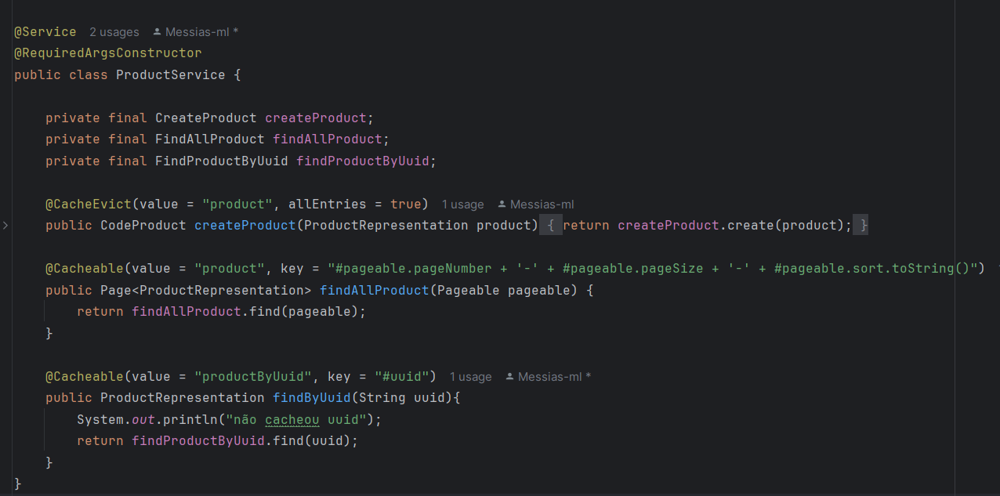

# Application Order Documentation

<h2>
Este sistema foi criado para gerenciar pedidos. 
O intuito é: O usuário vai escolher os produtos que ela deseja comprar vai enviar para nosso sistema.  
O nosso sistema por sua vez vai calcular o pedido e fazer todo gerenciamento dele, possibilitando que a pessoa busque depois o seu pedido completo.
</h2>

<h3>Arquitetura usada:</h3>

<h3>Tecnologias usadas:</h3>

> <h3 style="font-weight:800"> Como subir as aplicações (serve para Order, Product e ItemOrder):</h3>
>
> - 1° Starta o Eureka Server
> - 2° Abra o terminal da sua IDE e executa o comando docker-compose up, para startar o mySql, redis a depender do projeto que suba. 
> - 3° Starta a aplicação que deseja (Order, ItemOrder, Product)
> - 4° Starta o Gateway
> - 5° Espera pelo menos 3 minutos antes de efetuar sua primeira requisição, pois o gateway precisa de tempo.

><h3> Porque optei pela utilização de cada tacnologia? </h3>
>
> > <h4 style="font-weight:800">Arquitetura de MicroServices</h4>
> >
> > Optei por usar essa arquitetura pela escalabilidade que ela nos propõe.
> >
> > 
>> **Beneficios:**
> >
> > Com microservices conseguimos separar os bancos de dados, sem engargalar nenhum e recebermos mais de 150 mil pedidos por dia.
> >
> > Poderemos crescer cada microservice sem a necessidade de mexer no outro e também, se necessário, criamos outras instancias para dar suporte ao que ja temos.
> 
> > <h4 style="font-weight:800"> Eureka Server</h4>
> >
> >Foi utilizado pois podemos receber mais de 150 mil pedidos por dia, visando a performance, optei por usar o eureka e assim poder ter N instancia de order, ou seja, varias aplicações rodando dentro do meu eureka.
>
> > <h4 style="font-weight:800"> Gateway</h4>
> >
> >Foi utilizado para fazer o BALANCEAMENTO DE CARGA, em aplicações altamente performaticas isso se torna MUITO RELEVANTE!
> Dessa maneira eu posso ter varias instancias, uma unica chamada para elas e o gateway conseguirá distribuir para cada instancia que eu tiver, fazendo com que não sobrecarregue **NENHUMA**.
>
> > <h4 style="font-weight:800"> Radis</h4>
> > 
> > Foi utilizado no projeto para fazer o cacheamento de alguns endPoints. 
> >
> >**Beneficios:**
> >
> >Com o cacheamento correto, conseguimos fazer que muitas requisiçõoes ao nosso banco seja economizada. Como por exemplo:
> >Se quero buscar por produtos e muita gente busca o tempo todo, podemos aplicar o cacheamento por um periodo de tempo, fazendo com que não va ao banco e execute essa requisição e assim conseguimos deixar a nossa aplicação MUITO mais performatica.
> >
> >Se antes recebiamos 10 requisições por minuto agora conseguimos receber apenas 1 (A fim de exemplo.)
> >
> 
> > <h4 style="font-weight:800"> Open API</h4>
>>
>> Se torna ESSENCIAL quando se temos uma aplicação com esse tipo de arquitetura.
> >
> >Com a utilização do OpenApi documentamos a nossa aplicação a fundo e de maneira bem especializada, como faço. Para que o consumidor da API não perca tempo tentando entende-la nem mesmo ligando para o back-end que desenvolveu para perguntar qual serviço é o que ele busca consumir. 
> >
> >**Beneficios:**
> >
> >Dessa maneira, tudo fica MUITO claro para o consumidor, economizando tempo da empresa e recurso.
>
> <h3> Subindo o OpenAPI 3 (Swagger) </h3>
>
> - 1° Starte a sua aplicação seguindo os passos do inicio do documento.
> Quando fizer isso, ache a porta no Log da aplicação:
> 
> 
> - 2° Copie essa porta e cole na url do swagger http://localhost:53560/swagger-ui/index.html

> <h3> QUALIDADES DA API </h3>
> 
>**ALTAMENTE PERFORMATICA:**
> - Todas querys eu tive o cuidade de fazer da melhor maneira possivel, utilizando LAZY LOADING.
> 
> 
> - **Cada consulta** ao banco faz apenas 1 query e não desgasta o banco com multiplas consultas, deixando a aplicação a mais performatica possivel.
> 
>
> - Como precisamos de uma aplicação super performatica tive o cuidade de colocar paginação em recursos criticos fazendo com que o banco não se sobrecarregue com varias consultas
> 
> 
> 
> - A serviços que foram devidamente cacheados a fim de reduzir requisições ao banco de dados fazendo com que a aplicação melhorasse MUITO a performance. 
> E o interessante nisso, é que da para configurar de acordo com a necessidade. O cache de UUID de produtos por exemplo, pode durar alguns dias, visto que muitas pessoas consomem esse serviço e os produtos não são atualizados com frequencia evitando requisições durante dias.
> 
> 
> 
> 
> **QUALIDADE EXEMPLAR:**
> 
> - Cada aplicação foi divida em micro service, deixando-a escalavel e com os bancos devidamente separados para não sobrecarregar nenhum. Evitei todo tipo de acoplamento.
> 
> - Toda aplicação foi desenvolvida com padrões SOLID, programado orientado a interface com inversão de dependencias deixando o sistema com facil manutenção por seguir um padrão MUITO BEM DEFINIDO!
> 
> - Filas muito bem pensadas na comunicação assincrona para possiveis expanções. Utilizamos fanout para caso precise notificar o cliente de alguma maneira ele também possa capturar essa mensagem emitida pela exchange.
> 
> - O sistema contou com cacheamento para funcionalidades, evitando requisições ao banco.
> 
> - Totalmente documentada e disponivel para o consumidor da api ter em mãos uma API de orgulho
> 
> - Foi utilizado as melhores pratica de desenvolvimento Rest e com tratamento de error de alto nivel. Contou até com tratamento de exception que acontecem com @Valid
> 
> - Foi utilizado ModelMapper de forma especializada com conversão de altissimo nivel para demonstração de aptidão a essa tecnologia SEM IMPACTAR NA PERFORMANCE do sistema.
>
> - E o mais importante: Cumpriu com o objetivo.

<h2>Product collection postman</h2>

~~~json
{
	"info": {
		"_postman_id": "305c1327-e6e2-495b-a0c6-fa82dfd4a283",
		"name": "Api product",
		"schema": "https://schema.getpostman.com/json/collection/v2.1.0/collection.json",
		"_exporter_id": "42595321"
	},
	"item": [
		{
			"name": "getAllProduct",
			"request": {
				"method": "GET",
				"header": [],
				"url": {
					"raw": "http://localhost:8080/product",
					"protocol": "http",
					"host": [
						"localhost"
					],
					"port": "8080",
					"path": [
						"product"
					]
				}
			},
			"response": []
		},
		{
			"name": "getProductByUuid",
			"request": {
				"method": "GET",
				"header": [],
				"url": {
					"raw": "http://localhost:8080/product/pr-1ee24d96dc",
					"protocol": "http",
					"host": [
						"localhost"
					],
					"port": "8080",
					"path": [
						"product",
						"pr-1ee24d96dc"
					]
				}
			},
			"response": []
		},
		{
			"name": "post product",
			"request": {
				"method": "POST",
				"header": [],
				"body": {
					"mode": "raw",
					"raw": "{\r\n    \"name\": \"MONITOR HP\",\r\n    \"price\": 15200\r\n}",
					"options": {
						"raw": {
							"language": "json"
						}
					}
				},
				"url": {
					"raw": "http://localhost:8080/product",
					"protocol": "http",
					"host": [
						"localhost"
					],
					"port": "8080",
					"path": [
						"product"
					]
				}
			},
			"response": []
		}
	]
}
~~~

<h2>Order collection postman</h2>

~~~json
{
  "info": {
    "_postman_id": "b72d5d48-d061-44c1-a4f2-aa899b5b36dd",
    "name": "Api order",
    "schema": "https://schema.getpostman.com/json/collection/v2.1.0/collection.json",
    "_exporter_id": "42595321"
  },
  "item": [
    {
      "name": "create order",
      "request": {
        "method": "POST",
        "header": [],
        "body": {
          "mode": "raw",
          "raw": "{\r\n    \"listOrderItem\": [\r\n        {\r\n            \"productName\": \"TV sansung\",\r\n            \"price\" : 2420.0,\r\n            \"count\" : 1,\r\n            \"uuidProduct\": \"pr-1238965MDE\"\r\n        }\r\n    ]\r\n}",
          "options": {
            "raw": {
              "language": "json"
            }
          }
        },
        "url": {
          "raw": "http://localhost:8080/order",
          "protocol": "http",
          "host": [
            "localhost"
          ],
          "port": "8080",
          "path": [
            "order"
          ]
        }
      },
      "response": []
    },
    {
      "name": "getOrderByUuid",
      "protocolProfileBehavior": {
        "disableBodyPruning": true
      },
      "request": {
        "method": "GET",
        "header": [],
        "body": {
          "mode": "raw",
          "raw": "{\r\n    \"idCartao\": 1,\r\n    \"cpf\": \"12822569630\",\r\n    \"endereco\": \"rua pedro botaro bla\",\r\n    \"limiteLiberado\": 20000\r\n}",
          "options": {
            "raw": {
              "language": "json"
            }
          }
        },
        "url": {
          "raw": "http://localhost:8080/order/or-ed58464672",
          "protocol": "http",
          "host": [
            "localhost"
          ],
          "port": "8080",
          "path": [
            "order",
            "or-ed58464672"
          ]
        }
      },
      "response": []
    }
  ]
}
~~~
