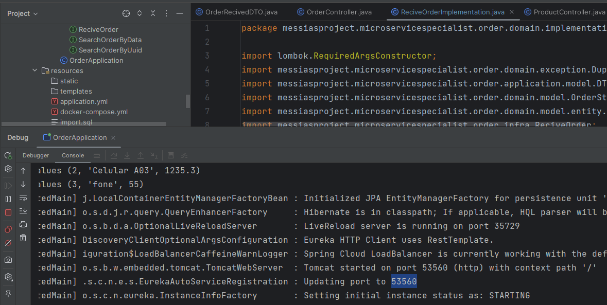
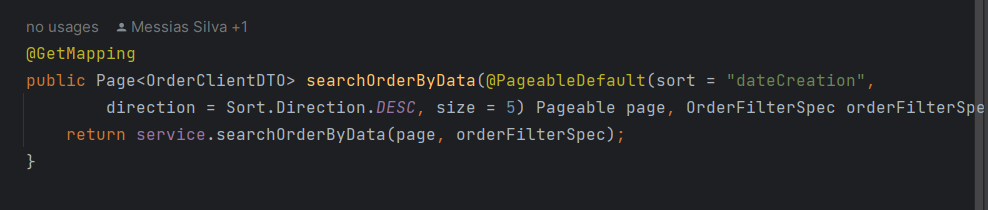

# Application Order Documentation

<h2>Este sistema foi criado para receber pedidos de uma API calcular e posteriormente enviar para outra API.</h3>

<h3>Tecnologias usadas:</h3>

> <h3 style="font-weight:800"> Como subir a aplicação:</h3>
>
> - 1° Starta o Eureka Server
> - 2° Executar o comando docker-compose up no arquivo resource da aplicação Order, para startar o mySql
> - 3° Starta o OrderApplication
> - 4° Starta o Gateway
> - 5° Espera pelo menos 3 minutos antes de efetuar sua primeira requisição, pois o gateway precisa de tempo.

><h3> Porque optei pela utilização de cada tacnologia? </h3>
>
> > <h4 style="font-weight:800"> MicroServices</h4>
> >
> > Optei por usar essa arquitetura pela flexibilidade que ela nos propõe.
> > 
>> **Beneficios:**
> >
> > Com microservice eu consigo crescer a aplicação futuramente e conectar a outro banco de dados como o de produto que é externo ao nosso e a comunicação entre produtos externos como estamos fazendo fica muito mais dinamica e facil sem a necessidade de sobrecarregar meu banco com dados de produtos, pedidos, clientes, items e etc.
> 
> > <h4 style="font-weight:800"> Eureka Server</h4>
> >
> >Foi utilizado pois podemos receber mais de 150mil pedidos por dia, visando a performance, optei por usar o eureka e assim poder ter N instancia de order, ou seja, varias aplicações rodando dentro do meu eureka.
>
> > <h4 style="font-weight:800"> Gateway</h4>
> >
> >Foi utilizado para fazer o BALANCEAMENTO DE CARGA, em aplicações altamente performaticas isso se torna MUITO RELEVANTE!
> Dessa maneira eu posso ter varias instancias, uma unica chamada para elas e o gateway conseguirá distribuir para cada instancia que eu tiver, fazendo com que não sobrecarregue **NENHUMA**.
>
> > <h4 style="font-weight:800"> Open API</h4>
>>
>> Se torna EXCENCIAL quando se tem uma aplicação que alguem irá consumir, alias, fazemos a aplicação com o intuito de alguém consumir e muitas vezes e 98% das vezes as pessoas se esquecem dos consumidores dificultando a vida deles
> > no consumo da API.
> > Diferente de mim, eu tenho a visão de que criamos a aplicação para facilitar a vida do front o que se faz necessario a especialização em uma documentação para eles.
> > Mostro minha apidão e especilização em Open Api neste projeto, criando uma documentação fantastica para o front da aplicação consumir, com riquezas de detalhes.
> >
> > **Beneficios:** Dessa maneira a empresa contratante ganha tempo e dinheiro, pois o front da aplicação não tem uma janela de tempo de aprendizado de como consumir a api.
> >
> > Exemplo: se ele levaria 10 dias para consumir uma API como essa, contando com 4 para entender, entrar em contato com o back criador da api, para depois consumir. Com a API documentada da maneira que fiz isso não acontece e evita o disperdicio de todo esse tempo e recursos.

> <h3> Subindo o OpenAPI 3 (Swagger) </h3>
>
> - 1° Starte a sua aplicação seguindo os passos do inicio do documento.
> Quando fizer isso, ache a porta no Log da aplicação:
> 
> 
> - 2° Copie essa porta e cole na url do swagger http://localhost:53181/swagger-ui/index.html

> <h3> QUALIDADES DA API </h3>
> 
>**ALTAMENTE PERFORMATICA:**
> - Todas querys eu tive o cuidade de fazer da melhor maneira possivel, utilizando LAZY LOADING.
> 
> 
> - **Cada consulta** ao banco faz apenas 1 query e não desgasta o banco com multiplas consultas, deixando a aplicação a mais performatica possivel.
> 
>
> - Como precisamos de uma aplicação super performatica tive o cuidade de colocar paginação em recursos criticos fazendo com que o banco não se sobrecarregue com varias consultas
> 
> 
> 
>
> **QUALIDADE EXEMPLAR:**
> 
> - Toda aplicação foi desenvolvida com padrões solid e inversão de dependencias deixando o sistema EXPANSIVO e de facil manutenção por seguir um padrão MUITO BEM DEFINIDO!
> 
> - Totalmente documentada e disponivel para o consumidor da api ter em mãos uma API de orgulho
> 
> - Foi utilizado as melhores pratica de desenvolvimento Rest e com tratamento de alto nivel de exceptions.
> 
> - Foi utilizado ModelMapper de forma especializada com conversão de altissimo nivel para demonstração de aptidão a essa tecnologia SEM IMPACTAR NA PERFORMANCE do sistema.
> 
> - E o mais importante: Cumpriu com o objetivo.
> 
> - Pensando em você disponibilizei meu postman também ja com as devidas requisições assinaladas, é so pegar o arquivo post que deixei no projeto e importar no seu postman.

~~~json
{
	"info": {
		"_postman_id": "02fff12d-0775-4d64-ad58-950f7a22b647",
		"name": "order",
		"schema": "https://schema.getpostman.com/json/collection/v2.1.0/collection.json"
	},
	"item": [
		{
			"name": "Product API TEST",
			"item": [
				{
					"name": "Create Product",
					"request": {
						"method": "POST",
						"header": [],
						"body": {
							"mode": "raw",
							"raw": "{\r\n    \"name\": \"fone\",\r\n    \"unitaryValue\": 55.0,\r\n    \"count\": 3\r\n}",
							"options": {
								"raw": {
									"language": "json"
								}
							}
						},
						"url": {
							"raw": "http://localhost:8080/order/product",
							"protocol": "http",
							"host": [
								"localhost"
							],
							"port": "8080",
							"path": [
								"order",
								"product"
							]
						}
					},
					"response": []
				}
			]
		},
		{
			"name": "Order",
			"item": [
				{
					"name": "Recive Order Externo A",
					"request": {
						"method": "POST",
						"header": [],
						"body": {
							"mode": "raw",
							"raw": "{\r\n    \"uuid\": \"op-234tr\",\r\n    \"listOrderItem\": [\r\n        {\r\n            \"idProduct\": 1,\r\n            \"count\": 3,\r\n            \"price\": 2420.0\r\n        },\r\n        {\r\n            \"idProduct\": 2,\r\n            \"count\": 2,\r\n            \"price\": 1235.3\r\n        },\r\n        {\r\n            \"idProduct\": 3,\r\n            \"count\": 4,\r\n            \"price\": 55\r\n        }\r\n    ]\r\n}",
							"options": {
								"raw": {
									"language": "json"
								}
							}
						},
						"url": {
							"raw": "http://localhost:8080/order",
							"protocol": "http",
							"host": [
								"localhost"
							],
							"port": "8080",
							"path": [
								"order"
							]
						}
					},
					"response": []
				},
				{
					"name": "Get list order to EXTERNO B",
					"request": {
						"method": "GET",
						"header": [],
						"url": {
							"raw": "http://localhost:8080/order?time=27-11-2024T16:00:00.000",
							"protocol": "http",
							"host": [
								"localhost"
							],
							"port": "8080",
							"path": [
								"order"
							],
							"query": [
								{
									"key": "time",
									"value": "27-11-2024T16:00:00.000"
								}
							]
						}
					},
					"response": []
				}
			]
		}
	]
}
~~~